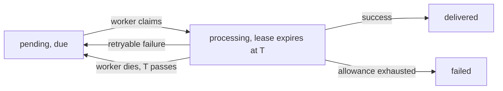

# Delivery Semantics

Hymical Forms delivers **at least once**. It does not offer exactly-once, and no
configuration makes it do so.

This page explains why, and what that means for the code on the other end.

## Leases

A worker takes ownership of a delivery by claiming it and setting a lease
expiry. While the lease holds, no other worker will touch the row.



A delivery is claimable when it is `pending` and due, **or** when it is
`processing` and its lease has expired. The second case is the whole point: a
worker that dies holding a job does not strand it in `processing` forever.

## The crash window

Here is the sequence that produces a duplicate:

1. Worker claims the delivery. State is `processing`.
2. Worker sends the HTTP request. Your server receives it and returns `200`.
3. Worker dies before it can write that outcome.
4. The lease expires. The delivery still says `processing`.
5. Another worker claims it and sends the same event again.

!!! danger "This window cannot be closed from this side"

    Between "the request was received" and "the outcome was recorded" there is
    always a moment where the process can die. Making the send and the record
    atomic would require a distributed transaction with your server, which is not
    something a webhook receiver offers.

No queue closes this on its own. It needs the receiver's cooperation.

## What you should do about it

**Deduplicate on the submission `id` in the signed payload.**

```json
{
  "type": "submission.received",
  "submission": {
    "id": "sub_48984534f33749c49a88de2d59400dce",
    "...": "..."
  }
}
```

That identifier is stable across every attempt and every replay of the same
logical delivery. Record the ones you have processed and ignore repeats.

Making your handler idempotent is worth doing regardless: it is also what makes a
[manual replay](../guides/delivery-replay.md) safe to run.

## Shortening the window

Lowering `FORMS_WORKER_LEASE_SECONDS` makes recovery from a dead worker faster.
It does not remove the window, and set too low it **creates** duplicates:
another worker can claim a delivery that is still in flight.

The lease must comfortably outlast `FORMS_WEBHOOK_CONNECT_TIMEOUT_SECONDS` and
`FORMS_WEBHOOK_READ_TIMEOUT_SECONDS` combined. The defaults leave a wide margin,
60 seconds against 15. See [Worker](../operations/worker.md).

## Two attempt counters

A delivery carries two counts, because they answer two different questions:

| Column | Question |
| --- | --- |
| `attempts` | How many requests has this delivery ever produced? |
| `cycle_attempts` | How many since it last entered the queue? |

`attempts` only ever rises, so it can number the audit trail without a number
ever being reused, however often a delivery is replayed.

`cycle_attempts` is what the retry allowance is measured against, and a replay
resets it to zero. That is what lets a replay grant a whole fresh schedule rather
than one last attempt against an allowance that is already spent.

Until something is replayed the two are the same number, which is why the
migration that introduced the second one backfilled it from the first.

## Terminal is terminal, until an operator says otherwise

`delivered` and `failed` are terminal states, and the worker never revisits
either. A `failed` delivery is not retried on its own and nothing notices it for
you: there is no alerting, no dead-letter notification and no automatic sweep.

An operator can put it back in the queue with
[manual replay](../guides/delivery-replay.md). That is a deliberate action, not a
background process, because a delivery that exhausted five attempts usually
failed for a reason that needs fixing first.

## What is recorded, and what is not

| Recorded | Not recorded |
| --- | --- |
| One row per logical delivery: state, counts, due time, completion | The response body from your server |
| One row per request that actually went out, numbered | The signing secret, in the attempt history |
| Outcome, HTTP status when there was one, bounded error text | Request headers |

A job that is inspected and found not due records nothing. Response bodies are
unbounded, written by somebody else's server, and nothing in this build reads
them back, so they are not stored at all.

## Related

- [Transactional outbox](transactional-outbox.md) for how the delivery got there
- [Concurrency](concurrency.md) for how two workers avoid the same row
- [Webhook delivery](../guides/webhooks.md) for the retry schedule and signing
