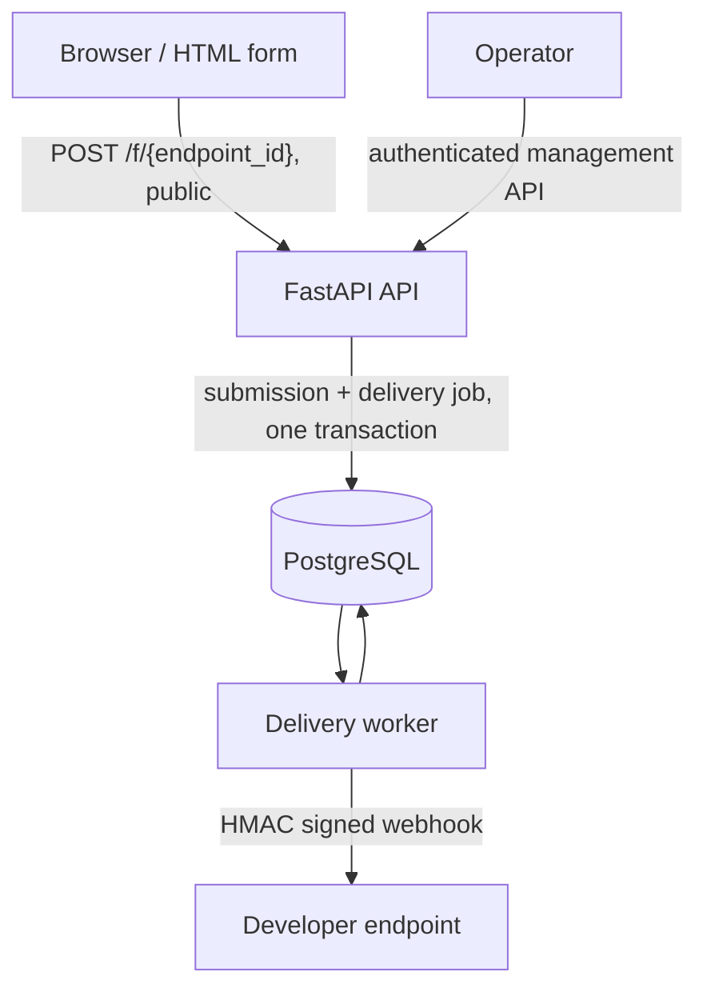

# Architecture Overview

Two processes, one database, no broker.



The API accepts a submission and, in the **same transaction**, records the
obligation to deliver it. It never makes an outbound request. The worker claims
owed deliveries, sends them, and retries the ones that fail.

That split is the whole design. A destination being unreachable can never affect
whether a form is accepted, and a crash in the API can never lose a delivery that
was implicitly promised by a `202`.

## Why PostgreSQL is the queue

There is no Redis, no RabbitMQ and no Kafka. The delivery queue is a table, and
workers claim from it with `SELECT ... FOR UPDATE SKIP LOCKED`.

That buys one thing that a separate broker cannot: the submission and the
delivery job are written in **one transaction**. With a broker, accepting a form
means writing a row and then publishing a message, and there is no way to make
those two atomic without either losing deliveries or inventing duplicates. See
[Transactional outbox](transactional-outbox.md).

It costs the throughput ceiling of a database table, which is far above anything
a form backend needs.

## Processes

| Process | Command | Does | Never does |
| --- | --- | --- | --- |
| API | `uvicorn hymical_forms.main:app` | Accepts submissions, serves management routes | Any outbound HTTP request |
| Worker | `python -m hymical_forms.worker` | Claims deliveries, sends them, retries | Authenticate through the HTTP API |
| CLI | `python -m hymical_forms.cli` | Creates, lists and revokes management keys | Anything over HTTP |

The API process holds **no outbound HTTP client at all**. Having nothing to send
with is the plainest way to keep the ingestion path free of network calls, and it
is what makes "replay sends nothing" structural rather than a promise.

## Module layout

```
src/hymical_forms/
  app.py            application assembly and startup
  apikeys.py        management key rules: format, generation, digesting
  cli.py            the operator command line for management keys
  config.py         typed settings
  db.py             engine and session lifecycle
  errors.py         the shared JSON error envelope
  delivery.py       the outbound webhook request itself
  ingestion.py      domain rules: endpoint IDs, submission validation
  middleware.py     request body size limit
  models.py         the persisted schema
  ratelimit.py      rate limit rules: windows, subjects, client address trust
  storage.py        queries and writes
  webhooks.py       webhook rules: URL validation, payload, signature, retry policy
  worker.py         the delivery worker process
  schema.py         the boundary between the application and Alembic
  main.py           ASGI entrypoint
  api/              HTTP routes and response models
    endpoints.py    creating, listing, inspecting and changing endpoints
    deliveries.py   reading the delivery queue and replaying a failed delivery
    submissions.py  public form ingestion
    security.py     the management authentication dependency
    pagination.py   the one cursor design both list routes share
  migrations/       Alembic environment and revisions
```

The rules that hold it together:

- **`ingestion.py`, `webhooks.py`, `apikeys.py` and `ratelimit.py` hold the domain
  rules** and know nothing about HTTP or the database. They can be tested without
  either.
- **`models.py` and `storage.py` are the only modules that write queries.** No SQL
  lives in a route handler.
- **`delivery.py` is the only module that makes an outbound request.**
- **`api/` translates** requests into domain rules and storage calls, and their
  outcomes into responses.
- **`api/security.py` holds the one authentication dependency** every management
  route declares, so the rules cannot drift apart route by route.
- **`worker.py` and `cli.py` are separate processes** and share only the database
  with the API.

## Configuration is per application, not global

Settings, the engine and the session factory are attached to the FastAPI
application's state rather than read from module-level singletons. A test, or a
future multi-tenant host, can run several differently configured applications in
one process, each with its own database.

That is also what lets the PostgreSQL test suite build several independent
applications, each with its own connection pool, and prove that rate limits are
enforced across them. See [Concurrency](concurrency.md).

## Storage notes

Submission fields are stored as a JSON object mapping each field name to the list
of values submitted under it, which is how repeated names survive intact. On
PostgreSQL the column is `json` rather than `jsonb`, because `jsonb` normalises
object key order and would silently reorder a form's fields. The payload is
written once and read whole, so `jsonb` indexing would buy nothing here.

Each request runs in one transaction, committed explicitly in the handler rather
than in the session teardown, so a failure becomes an error response instead of a
success for a row that never landed. Teardown runs after the response has been
sent, where raising could no longer change it.

## Where to go next

- [Transactional outbox](transactional-outbox.md) for the atomicity claim
- [Delivery semantics](delivery-semantics.md) for at-least-once and leases
- [Concurrency](concurrency.md) for how every race is settled
- [Security](security.md) for the boundaries and what is never stored
