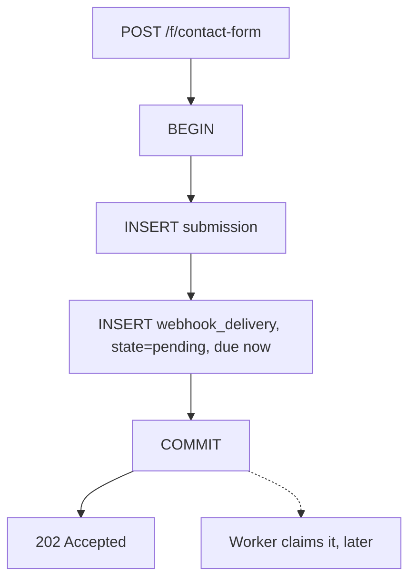

# Transactional Outbox

The reliability claim of this service is one sentence:

> Once `POST /f/{endpoint_id}` answers `202`, the submission is stored **and** the
> obligation to deliver it is stored.

Both, or neither. That is what an outbox buys.

## The problem it solves

Accepting a form and delivering it are two different things that happen at two
different times. The naive implementations both lose:

| Approach | Failure |
| --- | --- |
| Store the submission, then send the webhook inline | The request is now as slow and as available as somebody else's server. A crash after storing loses the delivery |
| Store the submission, then publish to a broker | A crash between the two loses the delivery. Publishing first invents deliveries for submissions that were never stored |
| Store the submission, sweep for undelivered rows later | Works, but needs a marker column, and that marker is an outbox by another name |

None of them can make "the row exists" and "the work is queued" atomic, because
they involve two systems.

## What actually happens

The queue is a table in the same database as the submission, so both writes are
one transaction:

A crash anywhere before the commit leaves the database untouched and the client
sees an error. A crash anywhere after it leaves both rows, and a worker will pick
the delivery up.

There is no state in which a form was accepted but the promise to deliver it went
missing, and none in which delivery work exists for a submission that does not.

## What is in the outbox row

The delivery **snapshots** what was owed at the moment the submission was
accepted:

| Column | Why it is a snapshot |
| --- | --- |
| `destination_url` | Changing an endpoint's webhook later must not redirect work already owed |
| `signing_secret` | A queued payload must never be signed with a secret its receiver never had |

It is not read through to the endpoint at delivery time. See
[Endpoint management](../guides/endpoint-management.md).

## One submission, at most one delivery

Enforced by a unique constraint on `submission_id`, not by application logic.

That is what makes "an idempotent replay never queues a second delivery" a
property of the database rather than of whichever code path happened to run. See
[Idempotency](../guides/idempotency.md).

## The network call happens with no transaction open

The worker claims a delivery in one committed transaction, closes it, makes the
outbound request, and then records the outcome in another.

Holding a database transaction across a call to somebody else's server would tie
the connection pool to how fast that server answers. A destination that takes
thirty seconds to time out would hold a connection for thirty seconds, and a
handful of them would exhaust the pool.

## No broker

PostgreSQL is the queue. Adding Redis or RabbitMQ would reintroduce exactly the
two-system atomicity problem the outbox exists to remove, in exchange for
throughput this workload does not need.

It also means one thing to back up, one thing to monitor, and one thing to run.

## Related

- [Delivery semantics](delivery-semantics.md) for what happens after the commit
- [Concurrency](concurrency.md) for how workers claim without colliding
- [Webhook delivery](../guides/webhooks.md) for the operator view
