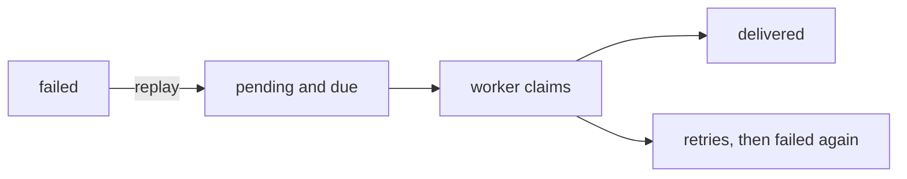

# Delivery Inspection and Replay

The delivery queue is operational data, so reading it needs a management API key.

```bash
export HYMICAL_KEY=hym_live_REPLACE_WITH_YOUR_KEY
```

## Listing deliveries

```bash
curl "http://127.0.0.1:8000/deliveries?state=failed&endpoint_id=contact-form" \
  -H "Authorization: Bearer $HYMICAL_KEY"
```

| Filter | Meaning |
| --- | --- |
| `endpoint_id` | Only deliveries for one endpoint |
| `state` | One of `pending`, `processing`, `delivered`, `failed` |
| `limit` | Page size, 1 to 100, default 50 |
| `cursor` | The previous page's `next_cursor` |

```json
{
  "items": [
    {
      "id": "whd_9a3f...",
      "submission_id": "sub_48984534f33749c49a88de2d59400dce",
      "endpoint_id": "contact-form",
      "state": "failed",
      "destination_url": "https://example.com/hooks/forms",
      "attempt_count": 5,
      "cycle_attempt_count": 5,
      "next_attempt_at": "2026-08-24T15:12:07.117440Z",
      "created_at": "2026-08-24T14:34:27.651841Z",
      "completed_at": "2026-08-24T15:12:07.204118Z"
    }
  ],
  "next_cursor": null
}
```

An unknown `state` is refused with `422 invalid_request`. An `endpoint_id` that
matches nothing is not an error: it is a filter that selected no rows, and the
answer is an empty page.

!!! note "Submitted field values are never returned"

    Not in the listing and not in the detail. There is no route that reads a
    submission back, and a delivery view is not a way around that.

## One delivery, with its attempt history

```bash
curl http://127.0.0.1:8000/deliveries/whd_9a3f... \
  -H "Authorization: Bearer $HYMICAL_KEY"
```

The same fields as one listed item, plus the ordered attempt history:

```json
{
  "id": "whd_9a3f...",
  "state": "failed",
  "attempt_count": 5,
  "cycle_attempt_count": 5,
  "attempts": [
    {
      "attempt_number": 1,
      "attempted_at": "2026-08-24T14:34:27.884210Z",
      "outcome": "http_error",
      "response_status": 503,
      "error": "destination responded with HTTP 503"
    }
  ]
}
```

Attempts are ordered by `attempt_number`, ascending. `outcome` is one of
`succeeded`, `http_error`, `timeout` or `network_error`. `response_status` is
null when the destination never answered at all.

The snapshotted signing secret, the request headers and the response body are not
there: the first two are never returned by any route, and the third is never
stored.

An unknown ID returns `404 delivery_not_found`.

## Replaying a failed delivery

```bash
curl -X POST http://127.0.0.1:8000/deliveries/whd_9a3f.../replay \
  -H "Authorization: Bearer $HYMICAL_KEY"
```

Returns `200 OK` with the delivery's new state:

```json
{
  "id": "whd_9a3f...",
  "state": "pending",
  "attempt_count": 5,
  "cycle_attempt_count": 0,
  "next_attempt_at": "2026-08-24T16:02:11.006318Z",
  "completed_at": null
}
```

**Only a delivery in terminal `failed` can be replayed.** A `pending` one is
already queued, a `processing` one is already being sent, and a `delivered` one
already reached its receiver. All three are refused with
`409 delivery_not_replayable`, and the error names the state that made it
ineligible.

`200`, not `202`. A `202` would say this request will be carried out later, which
invites reading the replay as the delivery. It is not. This request finishes here,
and what it leaves behind is a queued row.

## What replay actually does

Replay is a state change. **The API process sends nothing**: it has no outbound
HTTP client at all, which is what makes that structural rather than a promise.
The delivery becomes due, the ordinary worker claims it on its next poll through
its ordinary claiming path, and the ordinary retry rules apply from there.



Everything that identifies the delivery is preserved:

- the **same logical delivery**, not a second one
- the **same submission**, unmodified and not duplicated
- the **snapshotted destination and signing secret**, so the receiver verifies
  the replayed payload exactly as it would have verified the original
- **every historical attempt row**, untouched

## Attempt numbering and the retry budget

A delivery carries two counters, because they answer two different questions:

| Field | Meaning |
| --- | --- |
| `attempt_count` | Every request ever made for this delivery |
| `cycle_attempt_count` | Requests made since it last entered the queue |

`attempt_count` only ever goes up, and it is what numbers the attempt history, so
**an attempt number is never reused** however often a delivery is replayed.
`cycle_attempt_count` is what the retry allowance is measured against, and a
replay resets it to zero.

That is the whole model: a replay starts a fresh retry cycle while preserving the
history. A delivery that exhausted five automatic attempts and is then replayed
gets five more, numbered 6 through 10, rather than failing immediately because
five have already been spent. Until something is replayed the two counters are
equal.

## Two operators replaying at once

The transition is a single conditional `UPDATE` on the delivery's state, so the
database decides who wins, not a check in application code. Exactly one request
requeues the delivery. The other reads back the state that was actually settled on
and is refused with `409 delivery_not_replayable`, the same answer it would get
for a delivery that was never failed. No duplicate work is created either way.

This is tested against real PostgreSQL with independent connections. See
[Concurrency](../architecture/concurrency.md).

## A failed delivery is never retried on its own

It stays `failed` until an operator replays it, and nothing notices that it
failed for you: there is no alerting, no dead-letter notification and no
automatic sweep. Poll `GET /deliveries?state=failed` if you need to know.

## Related

- [Deliveries API reference](../api/deliveries.md)
- [Webhook delivery](webhooks.md) for the retry schedule a replay restarts
- [Worker](../operations/worker.md) for the process that picks a replay up
